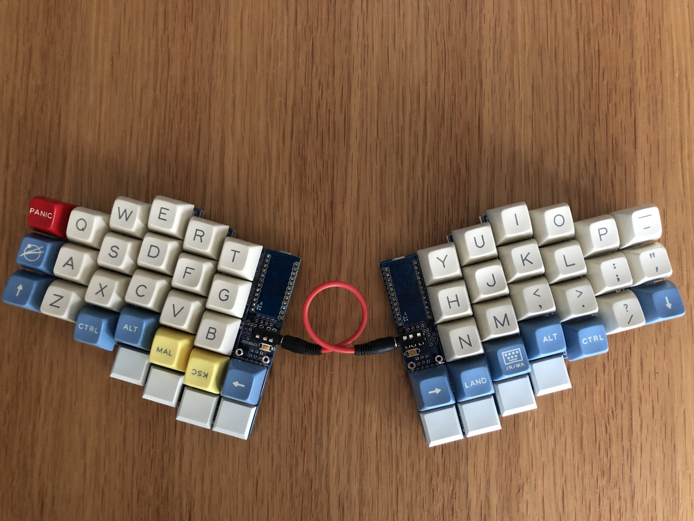
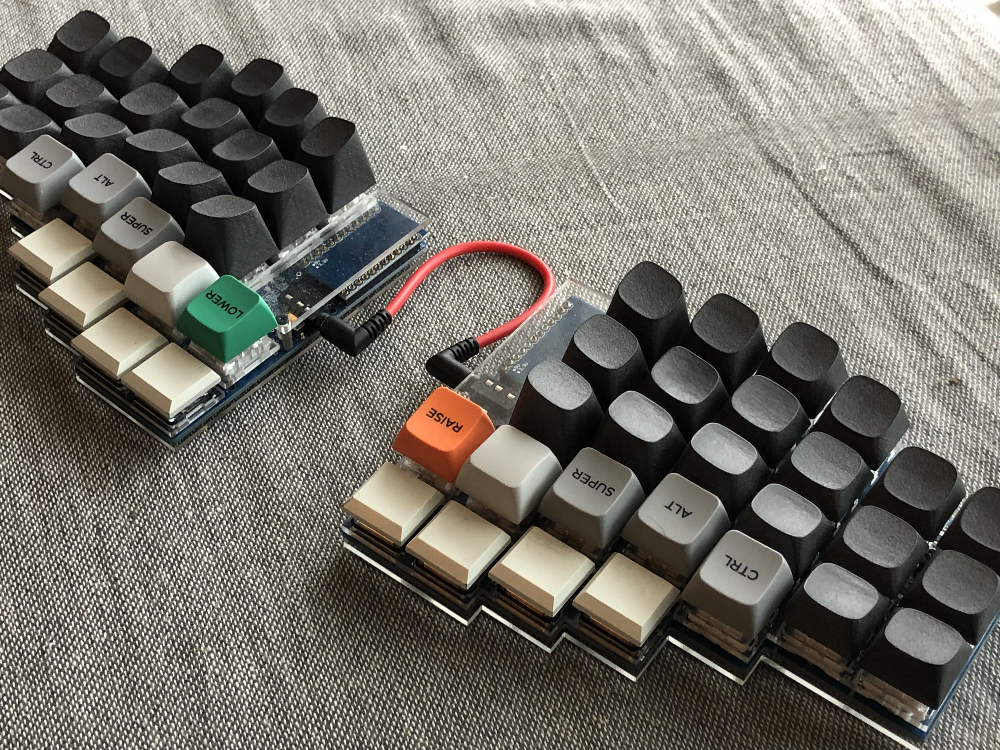

# xenon-keyboard
Xenon is 60% columnar staggered keyboard.

## xenon-classic

Full feature version Xenon
- Cherry MX and Kailh low profile key switch support
- OLED display
- Full color LED
- Prototype board area (behind the promicro)

Xenon with Godspeed custom SA keycap

Xenon with MiTo GMK Laser custom keycap

Xenon with MDA BigBang and 3D printed keycap

